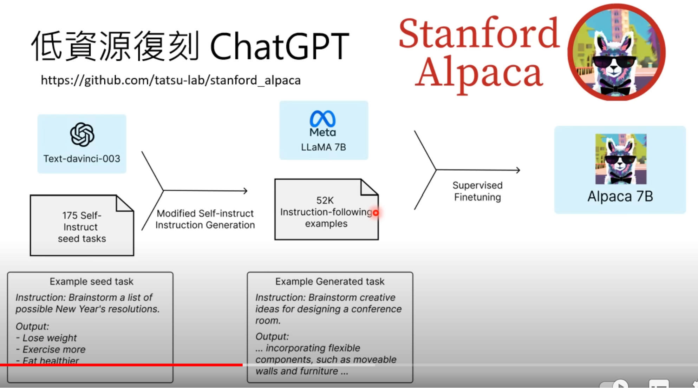
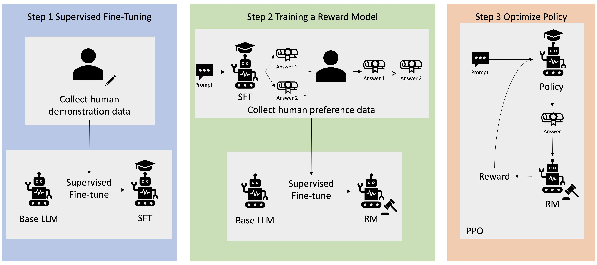

## PEFT
* full fine tunning cost (time & money)
* basic model > extra model (peft) > downstream task
* basic model > full fine tunning | knowledge distillation > perft > prompt
* peft can load, switch, disable
* one basic model + much peft model(s)
* knowledge distillation

* RAG

* RLHF
